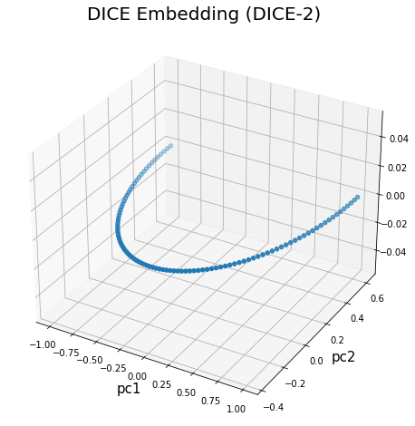
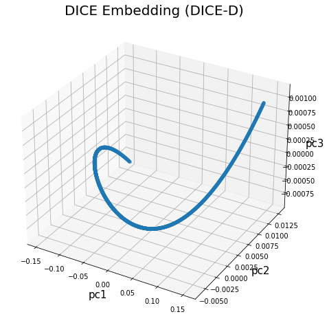

# Methods for Numeracy Preserving Word Embeddings (DICE) [Sundararaman et al., 2020](https://aclanthology.org/2020.emnlp-main.384.pdf)

Deterministic, Independent-of-Corpus Embeddings (DICE) is a non-contextual embedding for numbers that leverages the relation between the number distance and cosine similarity.

This method yields superior performance in non-contextual numerical tasks, such as computing the maximum and performing basic mathematical operations.

This repository provides the basic implementation of DICE embedding (not the evaluations).

I also provide a 2-D and 3-D visualizations of the DICE embeddings within the range [0,100] and [0,9999] to illustrate the characteristics of DICE embeddings and how they occupy the D-dimensional space using the orthonormal bases of a random matrix `M`, from which the orthonormal columns of Q are derived from with QR decomposition.

## 2-D Visualization (DICE-2) (range: [0, 100] / bound: s\_n \in [0,100])

## 3-D visualization (DICE-3) (range: [0, 1000] / bound: s\_m \in [0, 9999])

## 3-D Visualization (DICE-D) (D=256) (range: [0, 10000] / bound: s\_n \in [0,100])

